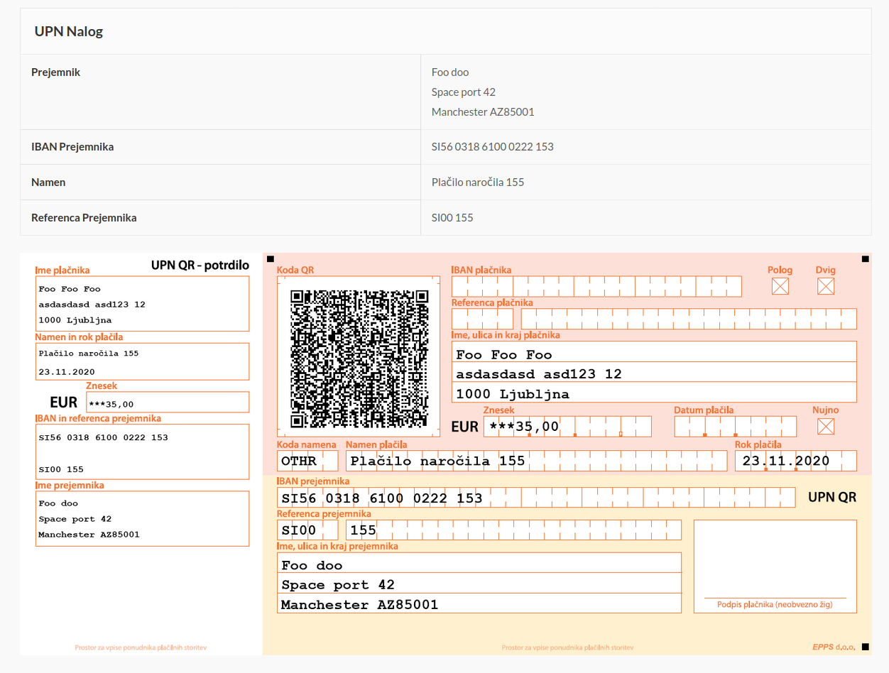

# WooCommerce UPN Nalog

Prikaže podatke za nakazilo in UPN Nalog z QR kodo ob koncu naročila, v sporočilu da je bilo naročilo sprejeto in pod pregledom naročil.



## Nastavitev

Za delovanje potrebuje nastavljen BACS (Direct Bank Transfer payment modul). Pozor IBAN mora biti pravilen drugače se obrazec ne prikaže.

Za prilagajanje se lahko uprabi naslednje filtre:

```php
apply_filters('upn_code', "OTHR");
apply_filters('upn_reference', "SI00 %s");
apply_filters('upn_purpose', 'Plačilo naročila %s');
```
